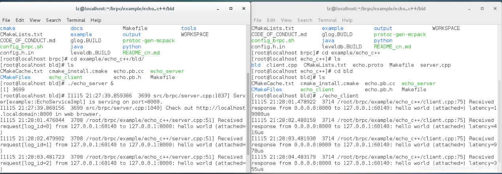
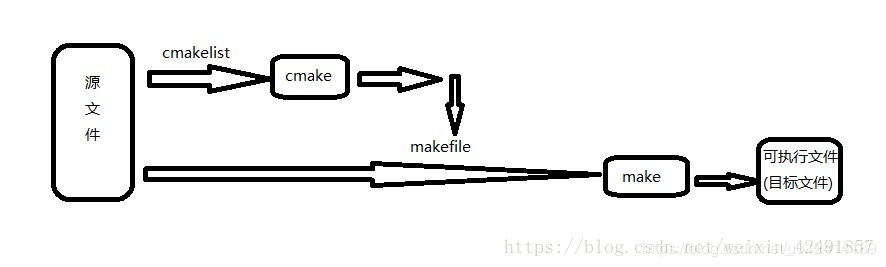

**一个贼有意思的问题**如果make完了之后，在make install,他给的例子就会编译不过去，如果只make不install,则会正常


[brpc搭建、编译和使用](https://blog.csdn.net/u012414189/article/details/84111338)
需要三个开源库：是gflags, protobuf和levedb。
gflags是用于像Linux命令行那样指定参数的，
protobuf用于序列和反序列化以及他的rpc定义。
leveldb用来压缩的。


# 1. cmake安装步骤


# 2. 安装步骤

**安装环境**：
   ```
   系统是centos7
   gcc版本是4.8.5，必须支持c++11
   gflag是2.1.1
   cmake是2.8.10
   protobuf是3.6.1
   ```
1. 安装依赖包。
  这里使用yum直接安装，所以系统没有yum，需要西安下载并安装，步骤如下
   -	#CentOS需要安装Epel，否则默认情况下许多软件包不可用。使用如下命令行：
sudo yum install epel-release

   -	通用的设备（deps）,使用如下命令行
sudo yum install git gcc-c++ make openssl-devel


   - 	安装gflags, protobuf, lebeldb:
  sudo yum install gflags-devel protobuf-devel protobuf-compiler leveldb-devel
   - 	如果须在在跑实列时启用CPU/堆分析器，安装如下：
sudo yum install gperftools-devel
   - 	如果需要运行测试，安装并且编译gtest-devel(尚未编译)：
sudo yum install gtest-devel

2. 下载brpc源代码编译安装
   -	 git clone https://github.com/brpc/brpc.git
   -	 cd ./brpc/
   -	 sh config_brpc.sh --headers=/usr/include --libs=/usr/lib64 --nodebugsymbols
   -	 make

3. 运行案例。
     百度给了很多案例，在git上，可以直接使用。这里使用最简单的读写列子。需注意的是，这里提供了两种编译方式，一种是编译成静态库，一种是编译成动态库。百度提供了静态库的makefile,直接make即可，动态库需要加上动态链接标志。

**静态链接**：
```
cd example/echo_c++
make
./echo_server &
./echo_client
```
**动态链接**：
```
cd example/echo_c++
LINK_SO=1 make
./echo_server &
./echo_client
```

**cmake**

除此之外，百度还提供了cmake的编译方式，给的案例中包含了cmakelist,我们只需要下载cmake工具，然后让他自己加载源文件，同时产生makefile,最后再编译成静态或者动态链接即可。

关于cmake工具的介绍与理解，可以看：[CMake简介](https://blog.csdn.net/u012414189/article/details/84111450)
```
cd example/echo_c++
mkdir bld && cd bld && cmake .. && make
./echo_server &
./echo_client
```
4. 结果
 

5.	Brpc介绍
又称baidu-rpc,是百度开发的一款“远过程调用”网络框架，目前该项目已在github上开源。
从应用方面来看，brpc目前被应用与百度公司的各种核心业务，包括：高性能计算和模型迅雷和各种索引和排序服务，目前有超过100万以上个实例是基于brpc工作的。
主要关注他的设计思想、性能、易用性和主流开源的rpc的对比上。

## 2.1. RPC
  rpc全程是Remote Procedure Call,即远过程调用。远过程调用的解释如下：
有a 和 b两个函数，b调用了a,即“过程调用”。若a b再同一台机器同一个进程和同一个线程被执行，就叫本地过程调用---local procedure call。

当a、b在同一台机器的不同进程种执行，这也是本地过程调用。当a需要执行的业务越来越负责，我们可能会让它独立成为一个进程而存在，这时候b想要调用a的函数，就需要使用管道等技术进行跨进程通信。
再进一步，a和b根本不再同一台机器上，此时b 调用a函数需要跨网络，这种调用就成为远过程调用。

b如和远过程调用a函数呢？一般a函数对应的进程会开放一个网络端口，它接受某种协议（比如HTTP）的请求，然后把结果打包成对应的协议戈斯和返回。b函数所在的进程则发起该请求，然后接收返回结果。

为了简化程序员的工作，就开发了rpc框架，brpc就是百度开发的。

可以使用它：
-	搭建能在一个端口支持多协议的服务, 或访问各种服务
-restful http/https, h2/gRPC。使用brpc的http实现比libcurl方便多了。从其他语言通过HTTP/h2+json访问基于protobuf的协议.
-	redis和memcached, 线程安全，比官方client更方便。
- rtmp/flv/hls, 可用于搭建流媒体服务.
- hadoop_rpc(可能开源)
- 支持rdma(即将开源)
- 支持thrift , 线程安全，比官方client更方便
- 各种百度内使用的协议: baidu_std, streaming_rpc, hulu_pbrpc, sofa_pbrpc, nova_pbrpc, public_pbrpc, ubrpc和使用nshead的各种协议.
- 基于工业级的RAFT算法实现搭建高可用分布式系统，已在braft开源。
- Server能同步或异步处理请求。
- Client支持同步、异步、半同步，或使用组合channels简化复杂的分库或并发访问。
- 通过http界面调试服务, 使用cpu, heap, contention profilers.
-	获得更好的延时和吞吐.
- 把你组织中使用的协议快速地加入brpc，或定制各类组件, 包括命名服务 (dns, zk, etcd), 负载均衡 (rr, random, consistent hashing)


## 2.2. gflags
gflags是google开源的用于处理命令行参数的项目。
安装之前需要先安装cmake工具，[CMake简介](https://blog.csdn.net/u012414189/article/details/84111450)

安装好之后，可以进行基础使用[google gflags 库完全使用](https://blog.csdn.net/u012414189/article/details/84256667)

比如：我们有个程序需要知道服务器的ip和端口。程序中有默认指定参数，同时希望可以通过命令行来指定不同的值
```C++
#include <iostream>
#include <gflags/gflags.h>
/**
 *  定义命令行参数变量
 *  默认的主机地址为 127.0.0.1，变量解释为 'the server host'
 *  默认的端口为 12306，变量解释为 'the server port'
 */
DEFINE_string(host, "127.0.0.1", "the server host");
DEFINE_int32(port, 12306, "the server port");

int main(int argc, char** argv) {
    // 解析命令行参数，一般都放在 main 函数中开始位置
    gflags::ParseCommandLineFlags(&argc, &argv, true);
    // 访问参数变量，加上 FLAGS_
    std::cout << "The server host is: " << FLAGS_host
        << ", the server port is: " << FLAGS_port << std::endl;
    return 0;
}
```
然后编译运行
## 2.3. Cmake
1. cmake与make的区别

   **写程序的大体步骤为**:
     - 用编辑器编写源代码，如.cpp文件。
     - 用编译器商城目标文件，如.o
     - 用链接器生成可执行目标代码生成可执行文件，如.exe

  但是如果源文件太多，一个一个编译时就会特别麻烦，于是诞生make工具来批量处理编译源文件。可以用一条命令实现完全编译。但是你需要编写一个规则文件，make依据它来批量处理编译，这个文件就是makefile,所以编写makefile文件也是程序员必备的技能。

  但是工程较大时，编写makefile实在时复杂，所以出现了cmake工具，自动生成makefile。cmake能够输出各种各样的makefile或者project文件。但随之而来的就是编写cmakelist文件，他是cmake所依据的规则。
 
2. Centos7使用cmake
  [CMake简介](https://blog.csdn.net/u012414189/article/details/84111450)


# 3. BUILD

brpc prefers static linkages of deps, so that they don't have to be installed on every machine running the app.

brpc depends on following packages:

* [gflags](https://github.com/gflags/gflags): Extensively used to define global options.
* [protobuf](https://github.com/google/protobuf): Serializations of messages, interfaces of services.
* [leveldb](https://github.com/google/leveldb): Required by [/rpcz](rpcz.md) to record RPCs for tracing.

# 4. Supported Environment

* [Ubuntu/LinuxMint/WSL](#ubuntulinuxmintwsl)
* [Fedora/CentOS](#fedoracentos)
* [Linux with self-built deps](#linux-with-self-built-deps)
* [MacOS](#macos)

## 4.1. Ubuntu/LinuxMint/WSL
### 4.1.1. Prepare deps

Install common deps:
```shell
sudo apt-get install git g++ make libssl-dev
```

Install [gflags](https://github.com/gflags/gflags), [protobuf](https://github.com/google/protobuf), [leveldb](https://github.com/google/leveldb):
```shell
sudo apt-get install libgflags-dev libprotobuf-dev libprotoc-dev protobuf-compiler libleveldb-dev
```

If you need to statically link leveldb:
```shell
sudo apt-get install libsnappy-dev
```

If you need to enable cpu/heap profilers in examples:
```shell
sudo apt-get install libgoogle-perftools-dev
```

If you need to run tests, install and compile libgtest-dev (which is not compiled yet):
```shell
sudo apt-get install libgtest-dev && cd /usr/src/gtest && sudo cmake . && sudo make && sudo mv libgtest* /usr/lib/ && cd -
```
The directory of gtest source code may be changed, try `/usr/src/googletest/googletest` if `/usr/src/gtest` is not there.

### 4.1.2. Compile brpc with config_brpc.sh
git clone brpc, cd into the repo and run
```shell
$ sh config_brpc.sh --headers=/usr/include --libs=/usr/lib
$ make
```
To change compiler to clang, add `--cxx=clang++ --cc=clang`.

To not link debugging symbols, add `--nodebugsymbols` and compiled binaries will be much smaller.

To use brpc with glog, add `--with-glog`.

To enable [thrift support](../en/thrift.md), install thrift first and add `--with-thrift`.

**Run example**

```shell
$ cd example/echo_c++
$ make
$ ./echo_server &
$ ./echo_client
```

Examples link brpc statically, if you need to link the shared version, `make clean` and `LINK_SO=1 make`

**Run tests**
```shell
$ cd test
$ make
$ sh run_tests.sh
```

### 4.1.3. Compile brpc with cmake
```shell
mkdir bld && cd bld && cmake .. && make
```
To change compiler to clang, overwrite environment variable CC and CXX to clang and clang++.

To not link debugging symbols, use `cmake -DWITH_DEBUG_SYMBOLS=OFF ..` and compiled binaries will be much smaller.

To use brpc with glog, add `-DWITH_GLOG=ON`.

To enable [thrift support](../en/thrift.md), install thrift first and add `-DWITH_THRIFT=ON`.

**Run example with cmake**
```shell
$ cd example/echo_c++
$ mkdir bld && cd bld && cmake .. && make
$ ./echo_server &
$ ./echo_client
```
Examples link brpc statically, if you need to link the shared version, use `cmake -DEXAMPLE_LINK_SO=ON ..`

**Run tests**
```shell
$ mkdir bld && cd bld && cmake -DBUILD_UNIT_TESTS=ON .. && make
$ cd test
$ sh run_tests.sh
```

## 4.2. Fedora/CentOS
要用cmake3，且要`yum install glog-devel`
### 4.2.1. Prepare deps

CentOS needs to install EPEL generally otherwise many packages are not available by default.
```shell
sudo yum install epel-release
```

Install common deps:
```shell
sudo yum install git gcc-c++ make openssl-devel
```

Install [gflags](https://github.com/gflags/gflags), [protobuf](https://github.com/google/protobuf), [leveldb](https://github.com/google/leveldb):
```shell
sudo yum install gflags-devel protobuf-devel protobuf-compiler leveldb-devel
```

If you need to enable cpu/heap profilers in examples:
```shell
sudo yum install gperftools-devel
```

If you need to run tests, install and compile gtest-devel (which is not compiled yet):
```shell
sudo yum install gtest-devel
```

### 4.2.2. Compile brpc with config_brpc.sh

git clone brpc, cd into the repo and run

```shell
$ sh config_brpc.sh --headers=/usr/include --libs=/usr/lib64
$ make
```
To change compiler to clang, add `--cxx=clang++ --cc=clang`.

To not link debugging symbols, add `--nodebugsymbols` and compiled binaries will be much smaller.

To use brpc with glog, add `--with-glog`.

To enable [thrift support](../en/thrift.md), install thrift first and add `--with-thrift`.

**Run example**

```shell
$ cd example/echo_c++
$ make
$ ./echo_server &
$ ./echo_client
```

Examples link brpc statically, if you need to link the shared version, `make clean` and `LINK_SO=1 make`

**Run tests**
```shell
$ cd test
$ make
$ sh run_tests.sh
```

### 4.2.3. Compile brpc with cmake
```shell
mkdir bld && cd bld && cmake .. && make
```
To change compiler to clang, overwrite environment variable CC and CXX to clang and clang++.

To not link debugging symbols, use `cmake -DWITH_DEBUG_SYMBOLS=OFF ..` and compiled binaries will be much smaller.

To use brpc with glog, add `-DWITH_GLOG=ON`.

To enable [thrift support](../en/thrift.md), install thrift first and add `-DWITH_THRIFT=ON`.

**Run example**
<font color='red'>注意：例子里的Cmakelist文件需要增加glog动态库路径</font>
```shell
$ cd example/echo_c++
$ mkdir bld && cd bld && cmake .. && make
$ ./echo_server &
$ ./echo_client
```
Examples link brpc statically, if you need to link the shared version, use `cmake -DEXAMPLE_LINK_SO=ON ..`

**Run tests**
```shell
$ mkdir bld && cd bld && cmake -DBUILD_UNIT_TESTS=ON .. && make
$ cd test
$ sh run_tests.sh
```

## 4.3. Linux with self-built deps

### 4.3.1. Prepare deps

brpc builds itself to both static and shared libs by default, so it needs static and shared libs of deps to be built as well.

Take [gflags](https://github.com/gflags/gflags) as example, which does not build shared lib by default, you need to pass options to `cmake` to change the behavior:
```shell
$ cmake . -DBUILD_SHARED_LIBS=1 -DBUILD_STATIC_LIBS=1
$ make
```

### 4.3.2. Compile brpc

Keep on with the gflags example, let `../gflags_dev` be where gflags is cloned.

git clone brpc. cd into the repo and run

```shell
$ sh config_brpc.sh --headers="../gflags_dev /usr/include" --libs="../gflags_dev /usr/lib64"
$ make
```

Here we pass multiple paths to `--headers` and `--libs` to make the script search for multiple places. You can also group all deps and brpc into one directory, then pass the directory to --headers/--libs which actually search all subdirectories recursively and will find necessary files.

To change compiler to clang, add `--cxx=clang++ --cc=clang`.

To not link debugging symbols, add `--nodebugsymbols` and compiled binaries will be much smaller.

To use brpc with glog, add `--with-glog`.

To enable [thrift support](../en/thrift.md), install thrift first and add `--with-thrift`.

```shell
$ ls my_dev
gflags_dev protobuf_dev leveldb_dev brpc_dev
$ cd brpc_dev
$ sh config_brpc.sh --headers=.. --libs=..
$ make
```

### 4.3.3. Compile brpc with cmake

git clone brpc. cd into the repo and run

```shell
mkdir bld && cd bld && cmake -DCMAKE_INCLUDE_PATH="/path/to/dep1/include;/path/to/dep2/include" -DCMAKE_LIBRARY_PATH="/path/to/dep1/lib;/path/to/dep2/lib" .. && make
```

To change compiler to clang, overwrite environment variable CC and CXX to clang and clang++.

To not link debugging symbols, use `cmake -DWITH_DEBUG_SYMBOLS=OFF ..` and compiled binaries will be much smaller.

To use brpc with glog, add `-DWITH_GLOG=ON`.

To enable [thrift support](../en/thrift.md), install thrift first and add `-DWITH_THRIFT=ON`.

## 4.4. MacOS

Note: In the same running environment, the performance of the current Mac version is about 2.5 times worse than the Linux version. If your service is performance-critical, do not use MacOS as your production environment.

### 4.4.1. Prepare deps

Install common deps:
```shell
brew install openssl git gnu-getopt coreutils
```

Install [gflags](https://github.com/gflags/gflags), [protobuf](https://github.com/google/protobuf), [leveldb](https://github.com/google/leveldb):
```shell
brew install gflags protobuf leveldb
```

If you need to enable cpu/heap profilers in examples:
```shell
brew install gperftools
```

If you need to run tests, install and compile googletest (which is not compiled yet):
```shell
git clone https://github.com/google/googletest && cd googletest/googletest && mkdir bld && cd bld && cmake -DCMAKE_CXX_FLAGS="-std=c++11" .. && make && sudo mv libgtest* /usr/lib/ && cd -
```

### 4.4.2. Compile brpc with config_brpc.sh
git clone brpc, cd into the repo and run
```shell
$ sh config_brpc.sh --headers=/usr/local/include --libs=/usr/local/lib --cc=clang --cxx=clang++
$ make
```
To not link debugging symbols, add `--nodebugsymbols` and compiled binaries will be much smaller.

To use brpc with glog, add `--with-glog`.

To enable [thrift support](../en/thrift.md), install thrift first and add `--with-thrift`.

**Run example**

```shell
$ cd example/echo_c++
$ make
$ ./echo_server &
$ ./echo_client
```

Examples link brpc statically, if you need to link the shared version, `make clean` and `LINK_SO=1 make`

**Run tests**
```shell
$ cd test
$ make
$ sh run_tests.sh
```

### 4.4.3. Compile brpc with cmake
```shell
mkdir bld && cd bld && cmake .. && make
```

To not link debugging symbols, use `cmake -DWITH_DEBUG_SYMBOLS=OFF ..` and compiled binaries will be much smaller.

To use brpc with glog, add `-DWITH_GLOG=ON`.

To enable [thrift support](../en/thrift.md), install thrift first and add `-DWITH_THRIFT=ON`.

**Run example with cmake**
```shell
$ cd example/echo_c++
$ mkdir bld && cd bld && cmake .. && make
$ ./echo_server &
$ ./echo_client
```
Examples link brpc statically, if you need to link the shared version, use `cmake -DEXAMPLE_LINK_SO=ON ..`

**Run tests**
```shell
$ mkdir bld && cd bld && cmake -DBUILD_UNIT_TESTS=ON .. && make
$ cd test
$ sh run_tests.sh
```

# 5. Supported deps

## 5.1. GCC: 4.8-7.1

c++11 is turned on by default to remove dependencies on boost (atomic).

The over-aligned issues in GCC7 is suppressed temporarily now.

Using other versions of gcc may generate warnings, contact us to fix.

Adding `-D__const__=` to cxxflags in your makefiles is a must to avoid [errno issue in gcc4+](thread_local.md).

## 5.2. Clang: 3.5-4.0

no known issues.

## 5.3. glibc: 2.12-2.25

no known issues.

## 5.4. protobuf: 2.4-3.4

Be compatible with pb 3.x and pb 2.x with the same file:
Don't use new types in proto3 and start the proto file with `syntax="proto2";`
[tools/add_syntax_equal_proto2_to_all.sh](https://github.com/brpc/brpc/blob/master/tools/add_syntax_equal_proto2_to_all.sh)can add `syntax="proto2"` to all proto files without it.

Arena in pb 3.x is not supported yet.

## 5.5. gflags: 2.0-2.21

no known issues.

## 5.6. openssl: 0.97-1.1

required by https.

## 5.7. tcmalloc: 1.7-2.5

brpc does **not** link [tcmalloc](http://goog-perftools.sourceforge.net/doc/tcmalloc.html) by default. Users link tcmalloc on-demand.

Comparing to ptmalloc embedded in glibc, tcmalloc often improves performance. However different versions of tcmalloc may behave really differently. For example, tcmalloc 2.1 may make multi-threaded examples in brpc perform significantly worse(due to a spinlock in tcmalloc) than the one using tcmalloc 1.7 and 2.5. Even different minor versions may differ. When you program behave unexpectedly, remove tcmalloc or try another version.

Code compiled with gcc 4.8.2 and linked to a tcmalloc compiled with earlier GCC may crash or deadlock before main(), E.g:


When you meet the issue, compile tcmalloc with the same GCC.

Another common issue with tcmalloc is that it does not return memory to system as early as ptmalloc. So when there's an invalid memory access, the program may not crash directly, instead it crashes at a unrelated place, or even not crash. When you program has weird memory issues, try removing tcmalloc.

If you want to use [cpu profiler](cpu_profiler.md) or [heap profiler](heap_profiler.md), do link `libtcmalloc_and_profiler.a`. These two profilers are based on tcmalloc.[contention profiler](contention_profiler.md) does not require tcmalloc.

When you remove tcmalloc, not only remove the linkage with tcmalloc but also the macro `-DBRPC_ENABLE_CPU_PROFILER`.

## 5.8. glog: 3.3+

brpc implements a default [logging utility](../../src/butil/logging.h) which conflicts with glog. To replace this with glog, add *--with-glog* to config_brpc.sh or add `-DWITH_GLOG=ON` to cmake.

## 5.9. valgrind: 3.8+

brpc detects valgrind automatically (and registers stacks of bthread). Older valgrind(say 3.2) is not supported.

## 5.10. thrift: 0.9.3-0.11.0

no known issues.

# 6. Track instances

We provide a program to help you to track and monitor all brpc instances. Just run [trackme_server](https://github.com/brpc/brpc/tree/master/tools/trackme_server/) somewhere and launch need-to-be-tracked instances with -trackme_server=SERVER. The trackme_server will receive pings from instances periodically and print logs when it does. You can aggregate instance addresses from the log and call builtin services of the instances for further information.
